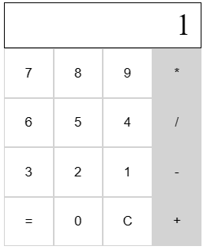

## Simple Calculator Uisng REACT (Without Node.js support)

<br/>





<br/>

#### CHECK MY CODE ON CODEPEN

* https://codepen.io/LakshithaCS/pen/zYLpXmd

<br/>

#### IMPORT REACT & REACT-DOM

* https://unpkg.com/react@17/umd/react.development.js
* https://unpkg.com/react-dom@17/umd/react-dom.development.js

<br/>

#### HTML ELEMENT

```html
<div id="root"></div>
```
<br/>

#### REACT CODE

```javascript
function Calculator() {
  const [display, setdisplay] = React.useState({
    current: 0,
    total: 0,
    isinitial: true,
    preOp: "",
  });

  function handleNumber(number) {
    // first time replace 0 with number
    let newvalue = number;

    // othertimes, concatenate
    if (!display.isinitial) {
      newvalue = display.current + number;
    }

    setdisplay({
      current: newvalue,
      total: display.total,
      isinitial: false,
      preOp: display.preOp,
    });
  }

  function doCalculations() {
    let total = parseInt(display.total);

    switch (display.preOp) {
      case "+":
        total += parseInt(display.current);
        break;
      case "-":
        total -= parseInt(display.current);
        break;
      case "*":
        total *= parseInt(display.current);
        break;
      case "/":
        total /= parseInt(display.current);
        break;
      default:
        total = parseInt(display.current);
    }

    return total;
  }

  function handleOperator(value) {
    let total = doCalculations();

    setdisplay({
      current: total.toString(),
      total: total.toString(),
      isinitial: true,
      preOp: value,
    });
  }

  function handleClear() {
    setdisplay({
      current: 0,
      total: 0,
      isinitial: true,
      preOp: "",
    });
  }

  function handleEqual() {
    let total = doCalculations();
    setdisplay({
      current: total.toString(),
      total: total.toString(),
      isinitial: true,
      preOp: "=",
    });
  }

  return (
    <div className="calculator">
      <div className="display">{display.current}</div>

      <CalcButton value="7" onClick={handleNumber} />
      <CalcButton value="8" onClick={handleNumber} />
      <CalcButton value="9" onClick={handleNumber} />
      <CalcButton value="*" className="operator" onClick={handleOperator} />

      <CalcButton value="6" onClick={handleNumber} />
      <CalcButton value="5" onClick={handleNumber} />
      <CalcButton value="4" onClick={handleNumber} />
      <CalcButton value="/" className="operator" onClick={handleOperator} />

      <CalcButton value="3" onClick={handleNumber} />
      <CalcButton value="2" onClick={handleNumber} />
      <CalcButton value="1" onClick={handleNumber} />
      <CalcButton value="-" className="operator" onClick={handleOperator} />

      <CalcButton value="=" onClick={handleEqual} />
      <CalcButton value="0" onClick={handleNumber} />
      <CalcButton value="C" onClick={handleClear} />
      <CalcButton value="+" className="operator" onClick={handleOperator} />
    </div>
  );
}

function CalcButton(props) {
  return (
    <button
      className={props.className}
      onClick={() => props.onClick(props.value)}
    >
      {props.value}
    </button>
  );
}

ReactDOM.render(
  <div className="container">
    <Calculator />
  </div>,
  document.getElementById("root")
);
```
<br/>

#### CSS

```css
.container {
  width: 400px;
  height: 400px;
}

.calculator {
  display: grid;
  grid-template-columns: repeat(4, 50px);
}

.display {
  grid-column-start: 1;
  grid-column-end: 5;
  height: 40px;
  font-size: 30px;
  text-align: right;
  border: 1px solid black;
  padding-right: 10px;
  padding-top: 5px;
}

button {
  height: 50px;
  background-color: white;
  border: 1px solid lightgray;
  cursor: pointer;
}

button.operator {
  background-color: lightgray;
}
```
<br/>
